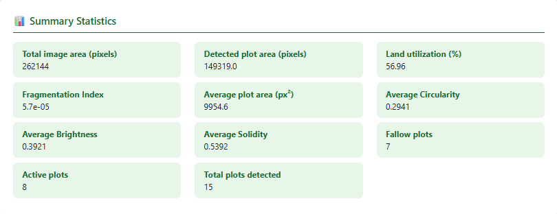

<div align="center">

# 🌾 DetectFarm AI

### Analyze satellite imagery, detect farmland plots, and generate AI-powered agricultural insights.

Developed during my **Undergraduate Research Internship** at the **Centre of Excellence in Product Design & Smart Manufacturing, MANIT Bhopal**.

<p>

<a href="https://sav06-detectfarm-ai.hf.space">

</a>

<a href="https://github.com/Savree97/DetectFarm-AI">

</a>

</p>

<p>


</p>

</div>

---

# 📖 Overview

DetectFarm AI is a **Computer Vision + Generative AI** web application that automatically analyzes RGB satellite imagery to identify farmland plots, extract meaningful agricultural features, and generate intelligent farming recommendations.

The application combines **OpenCV**, **Machine Learning**, and **Google Gemini 2.5 Flash** to transform raw satellite imagery into actionable agricultural insights through an intuitive web interface.

The project is fully containerized using **Docker** and deployed on **Hugging Face Spaces**.

> **DetectFarm AI demonstrates an end-to-end Computer Vision workflow—from image preprocessing and unsupervised plot analysis to AI-assisted decision support—packaged as a production-ready web application.**

---

# 🎯 Why DetectFarm AI?

Traditional satellite image analysis often requires expensive GIS software or manual inspection.

DetectFarm AI provides an accessible alternative by combining Computer Vision, Machine Learning, and Generative AI to automatically detect farmland plots, extract useful agricultural metrics, and generate actionable recommendations through a simple web interface.

---

# ✨ Features

- 🌾 Automatic farmland boundary detection
- 📊 Plot-level feature extraction
- 🤖 K-Means clustering
- 📈 Interactive analytics dashboard
- 📑 Excel report generation
- 🧠 AI-powered agricultural recommendations
- ☁️ Live deployment on Hugging Face Spaces

---

# 📸 Application Preview

| Home | Analysis |
|------|------|
|  |  |

| Statistics | AI Advisory |
|------|------|
|  |  |

---

# ⚙️ Workflow

```text
Satellite Image
      ↓
Image Processing
      ↓
Farmland Segmentation
      ↓
Feature Extraction
      ↓
K-Means Clustering
      ↓
Analytics Dashboard
      ↓
Excel Report + Gemini AI Advisory
```

---

# 🛠 Tech Stack

| Category | Technologies |
|-----------|--------------|
| Backend | Flask, Python |
| Computer Vision | OpenCV, scikit-image |
| Machine Learning | scikit-learn, K-Means, PCA |
| Data Processing | NumPy, Pandas |
| Visualization | Matplotlib |
| AI | Google Gemini 2.5 Flash |
| Deployment | Docker, Hugging Face Spaces |

---

# 🚀 Run Locally

```bash
git clone https://github.com/Savree97/DetectFarm-AI.git
cd DetectFarm-AI
pip install -r requirements.txt
python app.py
```

---

# 🐳 Docker

```bash
docker build -t detectfarm-ai .
docker run -p 7860:7860 detectfarm-ai
```

---

# 📂 Project Structure

```text
DetectFarm-AI
├── app.py
├── Dockerfile
├── requirements.txt
├── templates/
├── static/
├── screenshots/
└── README.md
```

---

# 🔮 Future Improvements

- Deep-learning based segmentation (SAM / U-Net)
- NDVI integration
- Weather API integration
- Crop classification
- Mobile application

---

# 👨‍💻 Author

**Savree Dohar**

B.Tech Computer Science & Engineering  
Thapar Institute of Engineering and Technology

**GitHub**  
https://github.com/Savree97

**LinkedIn**  
https://www.linkedin.com/in/savree-dohar-8a53002a2/

---

<div align="center">

⭐ **If you found this project useful, consider starring the repository!**

</div>
