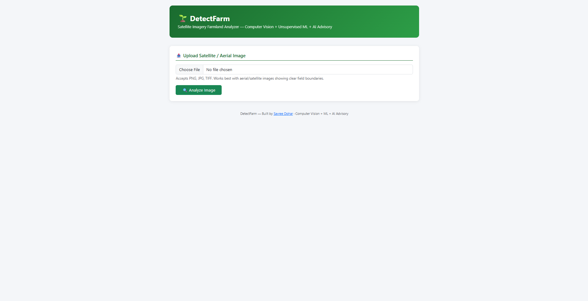
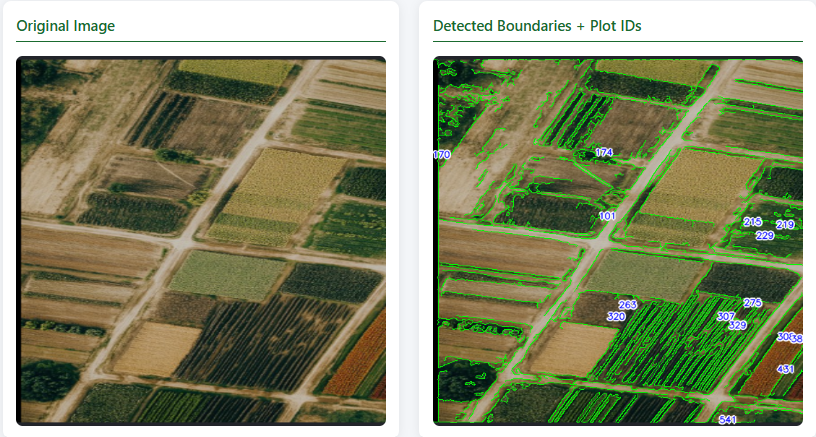
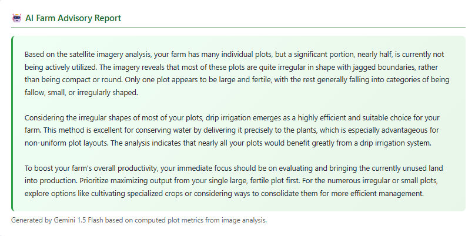

<div align="center">

# 🌾 DetectFarm AI

### AI-Powered Farmland Analysis using Computer Vision & Generative AI

Analyze RGB satellite imagery, automatically detect farmland plots, generate statistical insights, and receive AI-powered agricultural recommendations using **Google Gemini 2.5 Flash**.

Developed during my **Undergraduate Research Internship** at the **Centre of Excellence in Product Design & Smart Manufacturing, MANIT Bhopal**.

<br>

[](https://huggingface.co/spaces/sav06/detectfarm-ai)
[](https://github.com/Savree97/DetectFarm-AI)
[](https://python.org)
[](https://flask.palletsprojects.com/)
[](https://www.docker.com/)
[](https://opencv.org/)
[](https://ai.google.dev/)

</div>

---

# 🚀 Live Demo

### 🌐 Try DetectFarm AI

**Hugging Face Space**

👉 https://huggingface.co/spaces/sav06/detectfarm-ai

---

# 📖 Overview

DetectFarm AI is a production-ready **Computer Vision + Generative AI** application that analyzes RGB satellite or aerial farmland imagery to automatically identify agricultural plots, extract geometric features, perform unsupervised clustering, generate analytical visualizations, and produce AI-powered farming recommendations.

The application combines classical Computer Vision techniques with Machine Learning and Google's Gemini 2.5 Flash to provide meaningful agricultural insights from a single satellite image.

The project is fully containerized using Docker and deployed on Hugging Face Spaces.

---

# ✨ Features

- 🌍 Upload RGB satellite or aerial farmland images
- 🛰 Automatic farmland boundary detection
- 🧹 Image preprocessing using OpenCV
- ⚙ Otsu Thresholding
- 🔍 Morphological Processing
- 🌱 Connected Component Analysis
- 📊 Plot-level Feature Extraction
- 📏 Area & Perimeter Calculation
- 🔵 Circularity Analysis
- 💡 Brightness Estimation
- 🧱 Solidity Measurement
- 🤖 K-Means Clustering
- 📈 PCA Visualization
- 📊 Statistical Dashboard
- 📑 Excel Report Generation
- 🧠 AI-generated Farm Advisory using Gemini 2.5 Flash
- 🐳 Docker Deployment
- ☁ Hugging Face Spaces Deployment

---

# 🖼 Screenshots

## Home



---

## Plot Detection


---

## Summary Statistics



---

## AI Farm Advisory



---

# 🏗 System Architecture

```text
                    User
                      │
                      ▼
            Flask Web Application
                      │
                      ▼
          Upload Satellite Image
                      │
                      ▼
         OpenCV Image Processing
                      │
                      ▼
        Farmland Segmentation
                      │
                      ▼
       Connected Component Analysis
                      │
                      ▼
         Feature Extraction
                      │
                      ▼
      Machine Learning Pipeline
      (K-Means + PCA Analysis)
          │               │
          ▼               ▼
 Statistical Dashboard   Excel Report
                  │
                  ▼
          Gemini 2.5 Flash
                  │
                  ▼
       AI Farm Advisory Report
```

---

# 🔄 Processing Pipeline

```text
Satellite Image
        │
        ▼
Image Preprocessing
        │
        ▼
Grayscale Conversion
        │
        ▼
Gaussian Blur
        │
        ▼
Otsu Thresholding
        │
        ▼
Morphological Operations
        │
        ▼
Region Segmentation
        │
        ▼
Feature Extraction
        │
        ▼
K-Means Clustering
        │
        ▼
PCA Visualization
        │
 ┌─────────────┴─────────────┐
 ▼                           ▼
Charts & Statistics     Excel Report
                │
                ▼
      Gemini 2.5 Flash API
                │
                ▼
     AI Agricultural Advisory
```

---

# 🧠 AI Advisory

After extracting quantitative farmland metrics, DetectFarm AI uses **Google Gemini 2.5 Flash** to generate practical recommendations including:

- 🌱 Land utilization analysis
- 💧 Irrigation recommendations
- 🌞 Solar suitability assessment
- 🚜 Machinery accessibility
- 🌾 Fallow land identification
- 📈 Productivity improvement suggestions

---

# 🛠 Tech Stack

| Category | Technologies |
|----------|--------------|
| Backend | Flask, Python |
| Computer Vision | OpenCV, scikit-image |
| Machine Learning | scikit-learn, K-Means, PCA |
| Data Processing | NumPy, Pandas |
| Visualization | Matplotlib |
| AI | Google Gemini 2.5 Flash |
| Reports | OpenPyXL |
| Deployment | Docker, Hugging Face Spaces |

---

# 📂 Project Structure

```text
DetectFarm-AI
│
├── app.py
├── Dockerfile
├── requirements.txt
├── README.md
│
├── templates/
│
├── static/
│
└── screenshots/
    ├── home.png
    ├── upload.png
    ├── analysis.png
    └── advisory.png
```

---

# ⚙ Local Installation

```bash
git clone https://github.com/Savree97/DetectFarm-AI.git

cd DetectFarm-AI

pip install -r requirements.txt

python app.py
```

---

# 🐳 Docker

Build:

```bash
docker build -t detectfarm-ai .
```

Run:

```bash
docker run -p 7860:7860 detectfarm-ai
```

Open:

```
http://localhost:7860
```

---

# ☁ Deployment

The application is deployed using **Docker** on **Hugging Face Spaces**.

Required environment variable:

```text
GEMINI_API_KEY
```

---

# 📈 Future Improvements

- Segment Anything Model (SAM)
- U-Net based segmentation
- NDVI analysis
- Multi-temporal satellite imagery
- Crop classification
- Weather API integration
- Soil moisture prediction
- Mobile application
- Multi-language support

---

# 👨‍💻 Author

### Savree Dohar

B.Tech Computer Science & Engineering

Thapar Institute of Engineering and Technology

**GitHub**

https://github.com/Savree97

**LinkedIn**

https://www.linkedin.com/in/savree-dohar-8a53002a2/

---

<div align="center">

### ⭐ If you found this project interesting, consider giving it a star!

Made with ❤️ using Computer Vision, Machine Learning and Generative AI.

</div>
